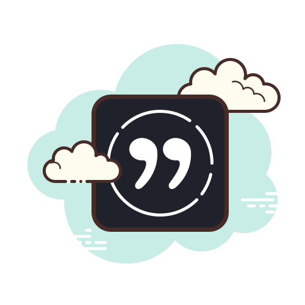

<table>
  <tr>
    <td></td>
    <td><h1>Daily Quotes Discord Bot</h1></td>
  </tr>
</table>


A simple Discord bot that sends an inspirational quote daily at a specified time to your Discord channel.  
The bot fetches quotes from [ZenQuotes API](https://zenquotes.io/).
<p align="center">
  
</p>

<br>

## 🔧 Requirements

- Python 3.10 or higher
- Python Libraries:
    - `discord.py`
    - `python-dotenv`
    - `pytz`
    - `requests`

- `.env` file with:
  - `TOKEN`: Token from Discord bot
  - `CHANNEL_ID`: Target Discord channel ID

<br>

## This project includes:
- ✅ The **Normal version** of code which is available in (`daily-quotes-bot/`) that contains the code, env and requirements file. - Ideal for running locally and testing.

  
- 🚀 A **Deployable version** (in the root directory) with a Flask keep-alive server — suitable for deployment on platforms like **Render**.

<br>

## ▶️ Instructions for Testing on Local Machine
1. Clone the Repository
```bash
git clone https://github.com/ziac007/daily-quotes-discord-bot.git
cd daily-quotes-discord-bot/daily-quotes-bot
```

2. Setup Virtual Environment (Optional)

3. Install Dependencies 
```bash
pip install -r requirements.txt
```

4. Add Your Bot Token and Channel ID to .env File

5. Run The Bot
```bash
 python dailyquote.py
```

<br>


## 🚀 Instructions for Deployment on Render
The root folder contains a version of the bot with a minimal Flask server to keep the app alive on free Render instances.
1. 🌐 Push Code to GitHub
2. ⚙️ Setup Environment Variables
    - In the Render dashboard:
    - Add a new 'Web Service'
    - Use your 'GitHub repo'
    - Set Environment Variables:
      - `TOKEN:` your Discord bot token
      - `CHANNEL_ID:` your Discord channel ID
3. 🔧 Configure Build & Start
    - Build Command
        `pip install -r requirements.txt`
    - Start Command:
       `gunicorn dailyquote:app --bind 0.0.0.0:8080`
4. 🟢 Prevent Idle Shutdowns (Optional but recommended)
    - Render's free tier spins down after inactivity.
    - To keep the bot alive: 
      - Use [UptimeRobot](https://uptimerobot.com/)
      - Add your Render URL as an HTTP monitor
      - Set it to ping every 5 minutes


<br>

## 📌 Deployment Notes
- ✅ Successfully deployed on **Render's free tier instance**
- ✅ Tested for **24 hours continuously** with **UptimeRobot** pinging every **5 seconds** to prevent idle shutdown
- ✅ On **paid Render instances**, Flask keep-alive is **not needed** — the bot runs continuously without any downtime


<br>
## ⚠️ Known Issue: Warning Message in Render Logs
When the bot is deployed, you may see the following warning in the logs:

WARNING: This is a development server. Do not use it in a production deployment. Use a production WSGI server instead.

This can be safely ignored if you’re running the bot for personal/non-production use with gunicorn.

